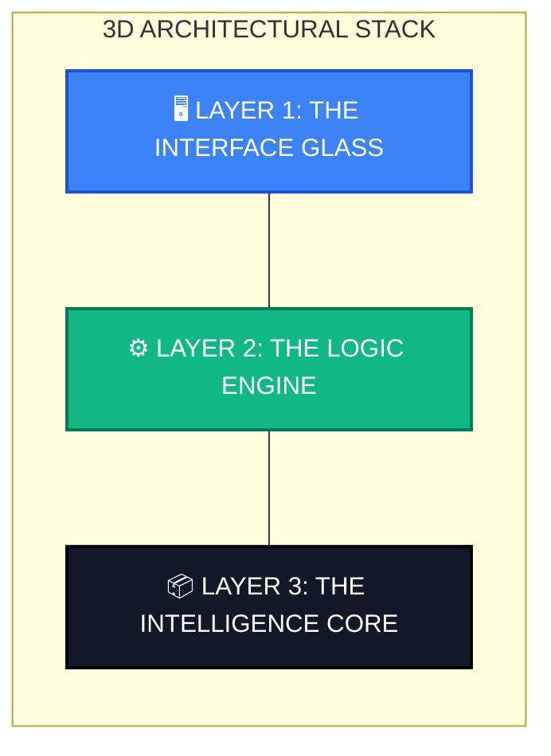

# CURA: AI-Powered Medical Intelligence & Recovery Dashboard

CURA is a state-of-the-art medical platform designed to bridge the gap between patient-reported experiences on social media and structured clinical insights. By leveraging advanced AI models for sentiment analysis, entity extraction, and credibility scoring, CURA provides patients and healthcare professionals with actionable data on drug efficacy, side effects, and recovery timelines.

---

## **Table of Contents**
1. [Core Features](#core-features)
2. [Project Structure](#project-structure)
3. [Technical Architecture](#technical-architecture)
4. [AI Pipeline & Data Flow](#ai-pipeline--data-flow)
5. [AI Model Specifications](#ai-model-specifications)
6. [Installation & Setup](#installation--setup)
7. [Environment Configuration](#environment-configuration)
8. [API Documentation](#api-documentation)
9. [Database Schemas](#database-schemas)
10. [Frontend Components](#frontend-components)
11. [Contact](#Contact)

---

## **Core Features**

### **1. Medical Intelligence Dashboard**
- **Reddit Data Ingestion**: Automated scraping of medical subreddits (e.g., r/Accutane, r/Metformin) to capture real-world patient discussions.
- **Optimized for Demo**: 
    - **API Limit**: **30 comments** per run (balanced for 15-20 sec response).
    - **Search Depth**: **10 pages** of comments per subreddit.
    - **Speed**: Reduced network timeouts and retries for faster feedback.
- **Recovery Analytics**: Dynamic visualization of symptom frequency and recovery progress using `Recharts`.
- **BS-Meter (Credibility Score)**: Uses Natural Language Inference (NLI) to fact-check Reddit drug claims against official FDA adverse event data.

### **2. Patient Empowerment Tools**
- **Personalized Recovery Trace**: Track individual side effects and compare them with aggregated community data.
- **Treatment Planning**: Integrated hospital and clinic finder using the Zembra API for immediate local support.
- **Privacy First**: HIPAA-compliant pipeline that masks personally identifiable information (PII) before any AI processing or storage.

---

## **Project Structure**

```bash
.
├── BACKEND/
│   ├── scripts/             # Python scrapers
│   │   ├── requirements.txt # Python dependencies
│   │   └── scraper.py       # Reddit scraping logic
│   ├── src/
│   │   ├── config/          # API & DB configurations
│   │   │   ├── bytez.js     # AI model setup
│   │   │   ├── db.js        # MongoDB connection
│   │   │   ├── openfda.js   # FDA API client
│   │   │   └── zembra.js    # Hospital API client
│   │   ├── controllers/     # Route handlers
│   │   ├── middleware/      # Auth & Error logic
│   │   ├── models/          # Mongoose Schemas
│   │   ├── routes/          # API Definitions
│   │   ├── services/        # AI & Business Logic
│   │   │   ├── anonymization.service.js
│   │   │   ├── bsMeter.service.js
│   │   │   ├── entityExtraction.service.js
│   │   │   └── redditScraper.service.js
│   │   ├── utils/           # Helper functions
│   │   ├── app.js           # Express app setup
│   │   └── server.js        # Entry point
│   └── package.json         # Node dependencies
├── FRONTEND/
│   ├── src/
│   │   ├── app/             # Next.js Pages & Layouts
│   │   │   ├── cura/        # Clinical dashboards
│   │   │   ├── login/       # Auth pages
│   │   │   ├── patient/     # Patient dashboards
│   │   │   └── profile/     # User settings
│   │   ├── components/      # UI Library
│   │   │   ├── BSMeterUI.js
│   │   │   └── ChronologicalTimeline.js
│   │   └── lib/             # API client utilities
│   └── package.json         # Next.js config
└── README.md                # Project Documentation
```

---

## **Technical Architecture (3D Layered View)**

<div align="center">
  
  
  
</div>

<br/>



### **🖥️ Layer 1: The Interface (Glass)**
> **The user-facing "Glass" layer. Built for speed and accessibility.**
- **Framework**: `Next.js 14` (App Router)
- **Design System**: `Tailwind CSS` + `Lucide Icons`
- **Data Viz**: `Recharts` (3D Line & Area Graphs)
- **State**: `React Server Components`

### **⚙️ Layer 2: The Logic (Engine)**
> **The "Engine" layer. Managing security, data flow, and real-time processing.**
- **Runtime**: `Node.js` (LTS)
- **API Architecture**: `RESTful Express Server`
- **Security**: `JWT Authentication` + `Bcrypt` + `Helmet`
- **Rate Limiting**: `Express-Rate-Limit` (40 req/hr)

### **📦 Layer 3: The Intelligence (Core)**
> **The "Core" layer. Where raw text becomes medical insight.**
- **AI Models**: `Bytez` (Biomedical NER, PII Redaction)
- **Fact-Checking**: `OpenFDA API` + `Natural Language Inference`
- **Scraping**: `Python 3.10` (Asynchronous Process Spawning)
- **Storage**: `MongoDB Atlas` (Document Store)

---

## **AI Pipeline & Data Flow**

The system follows a linear pipeline to transform raw social media text into structured medical insights:

1.  **Ingestion**: `redditScraper.service.js` spawns a Python sub-process to fetch posts/comments from Reddit.
2.  **Anonymization**: `anonymization.service.js` uses a PII-masker AI model to redact patient names, locations, and contact info.
3.  **Extraction (NER)**: `entityExtraction.service.js` uses a Biomedical-NER model to identify:
    -   `DRUG`: The medication name.
    -   `SIDE_EFFECT`: Reported symptoms.
    -   `DOSAGE`: Prescribed amounts.
    -   `TIMELINE`: Duration markers (e.g., "after 2 weeks").
4.  **Verification (BS-Meter)**: `bsMeter.service.js` compares the extracted side effects against the **OpenFDA** database using an NLI (Natural Language Inference) model.
5.  **Persistence**: Final structured data is saved as an `Insight` document in MongoDB.

---

## **AI Model Specifications**

CURA integrates several high-performance AI models via the Bytez API:

| Task | Model ID | Description |
| :--- | :--- | :--- |
| **Medical NER** | `biomedical-ner-all` | Extracts drugs, symptoms, and medical entities. |
| **PII Masking** | `pii-masker-tiny` | Detects and redacts PHI (Patient Health Information). |
| **Fact-Checking** | `nli-deberta-v3-small` | Natural Language Inference to calculate credibility. |
| **Sentiment** | `distilbert-base-uncased` | Analyzes patient mood and severity of side effects. |

---

## **Installation & Setup**

### **Prerequisites**
- **Node.js**: v18.0.0 or higher
- **Python**: v3.8 or higher
- **MongoDB**: Atlas Cluster (Cloud)
- **API Keys**: Bytez.com (AI), OpenFDA (Medical Data), Zembra (Hospitals)

### **Setup Instructions**

1.  **Clone & Install Dependencies**
    ```bash
    git clone https://github.com/rishab11250/CURA.git
    cd CURA/BACKEND && npm install
    cd ../FRONTEND && npm install
    pip install -r BACKEND/scripts/requirements.txt
    ```

2.  **Configure Environments**
    Create a `.env` in `BACKEND/` (see [Environment Configuration](#environment-configuration)).

3.  **Start the Services**
    ```bash
    # Terminal 1: Backend
    cd BACKEND && npm run dev
    
    # Terminal 2: Frontend
    cd FRONTEND && npm run dev
    ```

---

## **Environment Configuration**

Create a `.env` file in the `BACKEND/` directory:

```env
# Server
PORT=3000
NODE_ENV=development

# Database
MONGO_URI=mongodb+srv://<user>:<pass>@cluster.mongodb.net/medical_ai_db

# Auth
JWT_SECRET=your_secure_hex_string
JWT_EXPIRES_IN=30d

# AI & APIs
BYTEZ_API_KEY=your_bytez_key
OPENFDA_API_KEY=your_fda_key
ZEMBRA_API_KEY=your_zembra_key
```

---

## **API Documentation**

### **1. Authentication**
- `POST /api/auth/register`: Create a new user.
- `POST /api/auth/login`: Authenticate via Email or Mobile.
- `GET /api/auth/profile`: (Protected) Fetch user details.

### **2. Medical Insights**
- `POST /api/scrape`: Trigger Reddit ingestion for a drug.
    - *Body*: `{"drug": "accutane", "mode": "quick"}`
    - *Note*: Rate limited to 40 requests per hour for demo purposes.
- `GET /api/timeline/:drug`: Fetch aggregated recovery data.
    - *Response*: `[{"week": "Week 1", "symptom": "dry lips", "count": 12}]`
- `POST /api/verify`: Analyze a specific medical claim.
- `GET /api/hospitals`: Find facilities based on location string.

---

## **Database Schemas**

### **User**
Fields: `name`, `email`, `password`, `age`, `gender`, `mobileNumber`, `state`, `district`.

### **Post / Comment**
Stores raw Reddit data including `post_id`, `subreddit`, `title`, `text`, and `upvotes`.

### **Insight**
The output of the AI pipeline:
```javascript
{
  comment_id: String,
  drug: String,
  side_effect: String,
  dosage: String,
  timeline_marker: String,
  credibility_score: Number
}
```

---

## **Frontend Components**

- **BSMeterUI.js**: Interactive fact-checking interface showing FDA vs. Community data.
- **ChronologicalTimeline.js**: Multi-layered Recharts line graph showing symptom frequency over weeks.
- **CuraNavbar / Sidebar**: Role-based navigation for Patient and Clinician views.
- **RealTimeChat.js**: Prototype interface for patient-to-clinician communication.

---

## **The Team: CodeBros**

- **Rituraj Jha** (Team Lead & AI Strategy & Data Enigineer) - [@riturajjhaba938](https://github.com/riturajjhaba938)
- **Swaraj Prajapati** (Frontend & UX Lead) - [@SwarajPrajapati2006](https://github.com/SwarajPrajapati2006)
- **Rishab Chandgothia** (Backend & Data Engineer) - [@rishab11250](https://github.com/rishab11250)
- **Nikhil Raj** (UI / UX, Testing & Integration) - [@nikhilraj-13](https://github.com/nikhilraj-13)

---

## **Contact**

**Contact**: 
- **Main Repository**: [riturajjhaba938/CURA](https://github.com/riturajjhaba938/CURA)
- **Project Site**: [CURA Medical Intelligence](https://cura-ai.med)

---
*Disclaimer: CURA is an AI-driven research tool and should not be used for medical diagnosis.*
